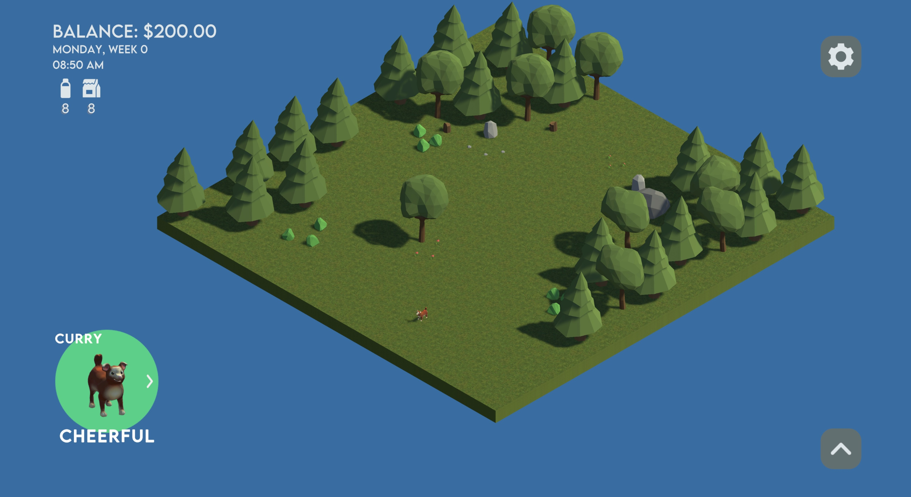

# My Dog Home source files

###### FinancialLit is the repository for the FBLA Intro to Programming 2025 - 2026 event submission source files, My Dog Home.

## Overview

> This is a Unity project made for the Introduction to Programming 2025 - 2026 FBLA competition, by Xavier McCoy.  

The goal of My Dog Home is to provide a realistic yet engaging experience of managing a pet's needs within a budget. Players must balance:

- Financial Management: Earning money through work minigame mechanics to afford food, shelter, and healthcare.
- Pet Wellness: Monitoring hygiene, entertainment, hunger, and energy levels.
- Home Customization: A building system that allows players to invest their savings into their pet's environment.

Event Links: [FBLA Overview](https://www.flfbla.org/fbla-event-introduction-to-programming) | [Details & Guidelines](https://www.fbla.org/high-school/competitive-events)

This project is currently in active development!



## How to view this project in the Unity editor

This project is actively being developed, so this process may change!  
To access My Dog Home's source files, you must have Unity Hub installed, as well as Unity Editor 6.0.

1. Clone the repository
```
git clone https://github.com/PoweringChurch/FinancialLit.git
```
2. Add to Unity Hub
   * Open Unity Hub and click Add > Add project from disk.
   * Navigate to the cloned folder and click Select Folder
3. Launch
   * Select the project from your list to open it in the Unity Editor

## Contributing

> No pull requests! Issues are welcomed.

To maintain compliance with FBLA competitive event rules regarding original work:
   * Pull requests are closed. Please do not submit pull requests to this repository.  
   * Issues are open. Suggestions, bug reports, and feedback via the "Issues" tab are highly encouraged and appreciated!

Author: Xavier McCoy, Paused development (Version 0.2)
